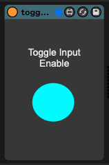
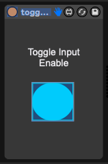
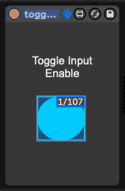
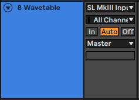
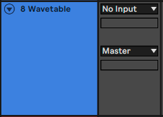

# m4l-js-toggleInput

This Max For Live gives you a button that you can map to a MIDI controller that
will toggle "No Input" for the selected track. This is useful for when you want
to record automation but not overwrite your notes or recorded audio.

## Usage

Add m4l-js-toggleInput to any track in your Live Set. I like to have a track called "META" for things like this.

Next, press Cmd-M (Mac) or Ctrl-M (Windows) and click the blue circle.

Now send any MIDI message to map the button. I use one of the assignable buttons on my BCR-2000 set to momentary mode.

Now, no matter what track is selected in Live, you can press that MIDI
controller button and toggle that track between No Input and whatever it was
set to previously. This makes it really easy to record automation without
disturbing notes or recurded audio.

_...click..._

## About the Code

This is written in Javascript for Max For Live, and interacts with the Live API
to get the input state of the currently selected track, then modifies that
input state.
